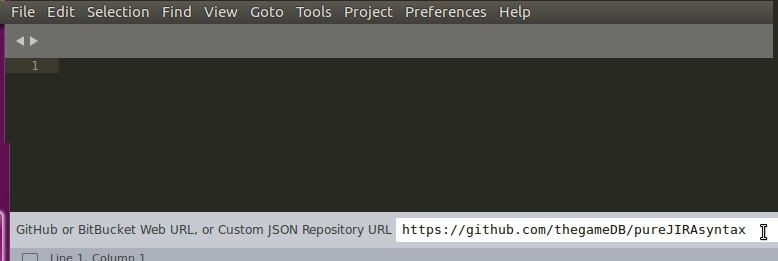

# Syntax highlighting for JIRA text formatting

## Install via Package Control instructions
- Install Package Control 
	- https://packagecontrol.io/installation
	- 
- Add the pureJIRAsyntax repository to Package control
	- Open **Command Palette**
		- Tools -> Command Palette
		- ⇧⌘P on Mac
		- Ctrl+Shift+P on Windows/Ubuntu
	- Type "Package Control: Add Repository"
		- 
	- Paste the GitHub URL for the repository
		- https://github.com/thegameDB/pureJIRAsyntax
		- 
- Install the pureJIRAsyntax package via Package Control
	- Open **Command Palette**
	- Type "Package Control: Install Package"
	- Start typing pureJIRAsyntax and select it from the list of packages
		- 
- Select the syntax to begin using
	- Tools -> Syntax -> PureJIRA
	- Or use the Syntax selector in the lower right hand corner of the Sublime window

## Manual install instructions
Place the unzipped directory "pureJIRAsyntax" into the Sublime Packages directory
- MacOS ~/Library/Application\ Support/Sublime\ Text\ 3/Packages/
- Windows C:\Users\YourUser\AppData\Roaming\Sublime Text 3\Packages\
- Linux - figure it out yourself 

To use, select the syntax by clicking in the lower right hand corner (most unsaved files will default to "Plain Text") and select PureJIRA 

The default Sublime color scheme, Monokai, works but the highlight color is hard to see on the noformat areas of text. 
I included a modified version of Monokai named MonokaiPureJira that will show up in Preferences - Color Scheme... that has a different "selected" color
